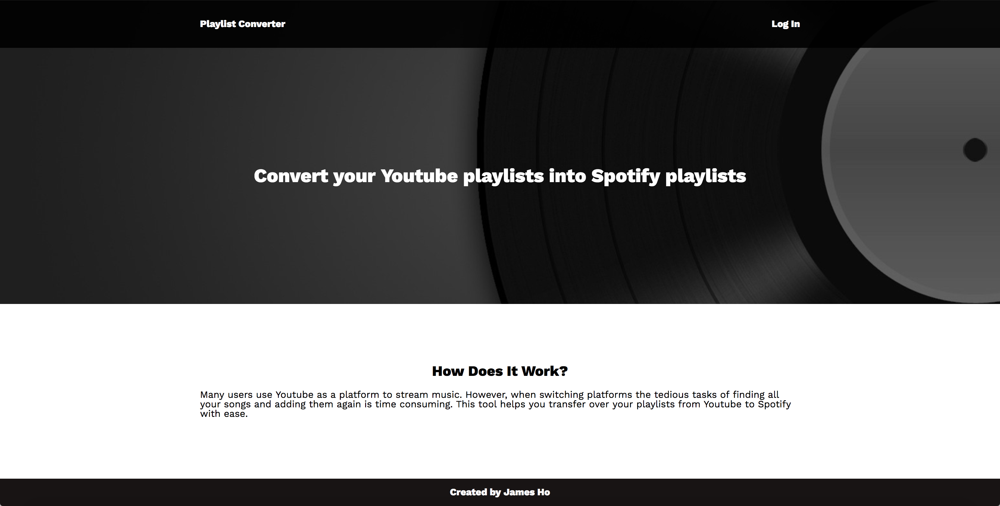
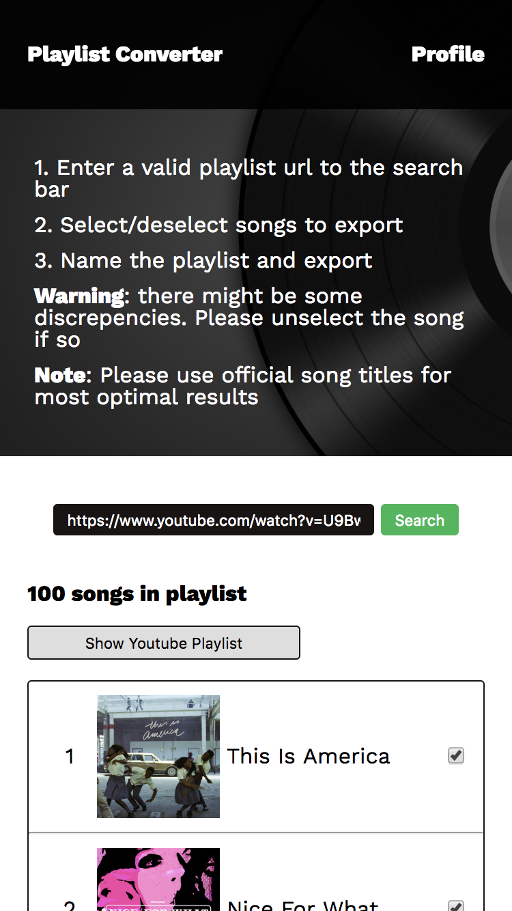
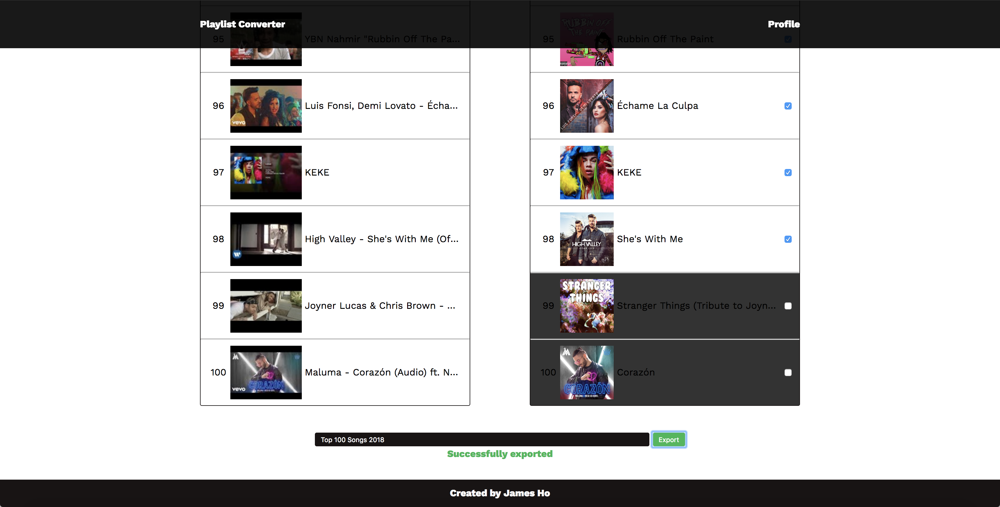
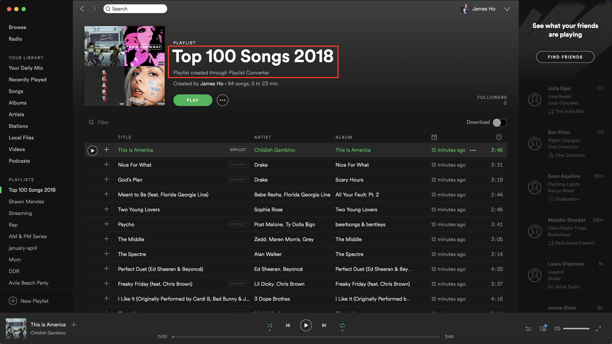

# Playlist Converter 

A simple tool to convert a Youtube playlist to a Spotify playlist on your account. A link to the live application can be found [here](http://ohjamesho.com/playlist-converter){:target="_blank"}

## Motivation

After switching to the Spotify platform, I never looked back. I have heard of people reluctant to make the switch to Spotify from Youtube because of the tedious process of adding all their songs again. This web application was developed to address that problem. Browsing online, there was not a similar solution found.

## Screenshots

### Landing Page

### Spotify Login

### Landing Page (Logged In)

### Search Results

### Search Results (Mobile)

### No Corresponding Song

## Unselected Song

### Export

### Spotify Playlist

## Summary

Begin by logging in with your Spotify account. (At the moment you may get a warning about secure server cause my domain does currently does not have an SSL). Once you logged in you will be directed to the same page with a different screen. There will be a search bar to put in an Youtube playlist url. Once submitted, it will obtain all the songs from the Youtube playlist and find all corresponding songs through Spotify.

Please use a Youtube playlist with official song titles as Spotify's searching feature is highly sensitive. If a corresponding song cannot be found it will be indicated on the second list with all the Spotify songs found. Furthermore, if an incorrect song is matched you can unselect it with the checkbox.  Few generic filters have been placed to eliminate common phrases found on youtube songs like "(Official Music Video)" and "(Audio)". Common issues with the Spotify search entails collaborations or remixes.

## Built With

### Front-End
* HTML
* CSS
* jQuery

### Apis Used
* Youtube API
* Spotify API
